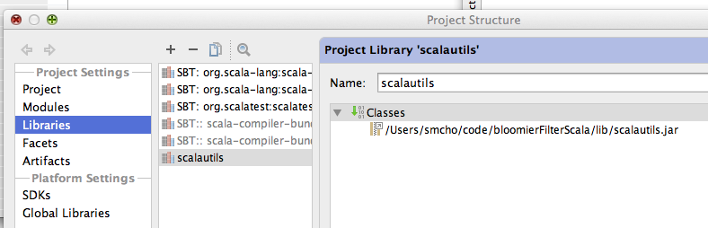

# BloomFilterCascade

This is an implementation of BloomFilterCascade in Scala programming language. This is used for understanding how Bloom Filter Cascade works as described in [The Bloomier Filter](https://www.cs.princeton.edu/~chazelle/pubs/soda-rev04.pdf) paper. 

# Theory and Algorithms
Refer to the document in doc/bfcascade.pdf

# Development environment
## JetBrain IDEA
The code is implemented in [JetBrain's IDEA 13.1](http://www.jetbrains.com/idea/?gclid=Cj0KEQjwur2eBRDtvMS0gIuS-dYBEiQANBPMR2cbISC8tkLcvpeV4q44S_2ikOpg8gdu-ht1kTjv9SwaAkCj8P8HAQ) with Scala plugin: IDEA with Scala plugin must be installed in order to build the code using IDEA. 

## SBT
It also has build.sbt, so you also can use sbt. 

    sbt compile <- for build
    sbt test <- for test
    sbt package <- for generating jar 

# Dependent library

## Download the library
BFC depends on [Scala Utils](https://github.com/prosseek/scalaUtils). The jar file should be downloaded from github, or built from source code. 

1. Download the jar file from github <https://github.com/prosseek/scalaUtils/tree/master/export>
2. Build the code
    1. `sbt package`
    2. The jar is created in `target/scala-2.10` directory.  
    
## Copy the jar file in the lib directory

1. Copy the jar file in `lib` directory.
2. In JetBrains IDEA, open the Project Linbrary.
    1. In Project Settings, click Libraries 
    2. Add the jar file  
