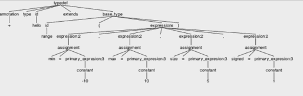

### How parse tree to node tree works

We have a grammar for `typedef`:

    typedef: annotation TYPE id EXT  base_type ;
    base_type: id '(' expressions ')';

    expressions: (expression ','?)+;
    expression: comparison | assignment | function_call | primary_expresion;
    comparison: ID comparison_operator primary_expresion;
    assignment: ID '=' primary_expresion ;
    function_call: ID '(' (primary_expresion ','?)* ')';
    annotation: ('+'|'-');
    comparison_operator: '<'|'>'|'<='|'>=';
    
With an input `+type hello extends range(min=-10, max=10, size=5, signed=1)`, antlr generates a parse tree

The TypeNode is class that has anotation, base_type, and a list of expressions. 

    class TypeNode(override val name:String) extends Node(name = name) {
      var annotation = Annotation.PUBLIC
      var base_type:String = _
      val expressions = ListBuffer[ExpressionNode]()
    }
    
We need to dive into the tree to extract the only information we need from the tree.

The automatically generated `visitTypedef` tree contains abstracts the subtrees and they can be accessed with `ctx`. 
Each sub grammar element is accessed with a method call from `ctx`: e.g., `ctx.id()` to retrieve the tree that abstracts `id` in the grammar. When the subtree has multiple elements with `+` (`(expression ','?)+;`) the `children.iterator()` returns an 
iterator to enumeate all the subtree elements. 

    override def visitTypedef(ctx: ChitchatParser.TypedefContext) : Node = {
      val name = ctx.id().getText()
      val typenode = new TypeNode(name)
      
      val base_type = ctx.base_type()
      typenode.base_type = base_type.getText()
      
      val it = base_type.expressions().children.iterator()
      while(it.hasNext) {
        val res = it.next()
        // res is comma separated assignemnt
        if (res.getText() != ',') {
          visit(res)
        }
      }
      
The res in `visit(res)` makes the `ChitchatParser.ExpressionContext` and corresponding visitor is called. 