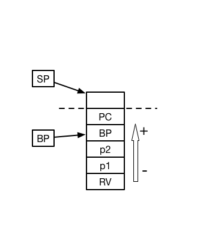

## Concepts
* TOS (Top of stack) == SP - 1
* NP (Number of parameter)
* BP tracks the frame, and parameters are accessed via BP
    * bp - 1 (last parameter)
    * bp - NP (first parameter)
    * bp - (NP + 1) (return value)
    * bp + 1 (return address)
    * After the return from called function, bp + 2 points to the return value

### Function call mechanism

#### Caller before calling the callee

1. push 0 # storage reserve
2. push p1 ... pn (push n parameters after evaluating each expression)
3. link 
    * push bp
    * mov sp - 1 => bp
4. push ip
    * ip always points to the next instruction (in process function)
5. jmp to the callee

#### Callee when return

1. Check the concepts (BP part)
    * callee knows the parameters and can use them as variables
2. When everything is finished
    * store the return value to (bp - (NP + 1))
3. pop and store to address# remove pc
2. pop bp
3. pop N times (number of parameters)
4. pop temp # now temp holds the return value
4. jmp address 

#### Caller after calling the callee
1. TOS contains the return value from the function call
2. pop temp to use it

### Registers
* BP
* SP
* Temp
* IP

## Commands

### Stack

#### Push
* link
    * push bp & mv (sp - 1) -> bp
* push <REGISTER>
* push VALUE

#### Pop
* pop # remove the value
* pop temp/bp 

### Expression

#### cmp
* cmp 

#### Integer

* iadd
* isub
* imul
* idiv

#### Double

* fadd
* fsub
* fmul
* fdiv