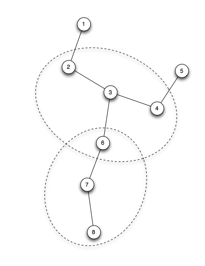

# Things to know
## Simulation principles
`Network#simulate()` is the simulation method for algorithm checking.
The structure is about reading sample file that contains sampled value, and executing the 
while loop forever until count becomes the endCount. 

    def simulate(self, sampleFile, endCount = None):
        # preprocessing
        for obj in self.hostDict.values():
            obj.readFromSampleDataFile(sampleFile)
            
        if endCount is None:
            endCount = SIMULATION_END
            
        count = 0
        while True:
            self.preparation(count)
            self.action(count)
            count += 1
            if count == endCount:
                break
                
            if Network.printResult: print "\n"
            
The simulation code in the while loop is two step process: `preparation` and `action`. 
In `preparation` step, `host#generateContext` is invoked to calculate the contexts that are going to send. `host#sendContexts` is filled depending on the computation results. 

    def preparation(self, count):
        for i, host in self.hostDict.items():
            host.generateContext(count, printFlag = Network.printResult)
    
The contexts that should be send is the followings.

1. The Context that has `hop-count < tau`.
2. The merged GroupContext.

In `Network#action()` method, the contexts are sent to the neighbors.
            
    def action(self, count):
        for i, host in self.hostDict.items():
            host.sendContextsToNeighbors(self.hostDict, printFlag = Network.printResult)
            
Note that sending Contexts actually executes the `host#receiveContexts()` method of the neighboring nodes. 

    def sendContextsToNeighbors(self, hostDict, printFlag = True):
        for n in self.neighbors:
            nobject = hostDict[n]
            nobject.receiveContexts(self.sendContexts, self.id, printFlag)
            
`Network#hostDict` contains the dictionary that maps from host id, to the host object. 
Note that the key is `id` number which is an integer. 

    def buildHost(self, topology = None):
        if topology is None:
            topology = self.networkTopology 
    
        for key, values in topology.items():
            self.hostDict[key] = Host(key, values)
            
        return self.hostDict
        
    def networkFileParsing(self):
        if self.networkTopology: return self.networkTopology
 
        with open(self.networkFile, 'r') as f:
            for l in f:
                first, rest = getFirstRest(l)
                self.networkTopology[first] = rest
               
This is the network topology file content. First column shows the host id, and the rest of the line is the neighboring node ids. 

    1: 2
    2: 1 3
    3: 2 4 6
    4: 3 5
    5: 4
    6: 3 7
    7: 6 8
    8: 7

## Create the contexts to send
Based on the algorithm 1, `contextAggregator#aggregate()` computes the maximally merged GroupContext. The input for this method should be:

1. The individual contexts it has calculated so far. 
2. The incoming GroupContext or Context from neighboring nodes.

The `contextAggregator#aggregate()` method also returns prime aggregates and non-prime aggregates also. 

## Use `same` not `==` in list comparisons.
We have two lists, in terms of comparison, you cannot use `==` operator.
Consider this example:

    class A(object): pass
    
    a = A()
    b = A()
    c = A()
    
    print [a,b,c] == [a,b,c] # True
    print [a,b,c] == [c,b,a] # False
    
The list members should be the same and in the same order.
    
So, when you do some comparisons with the return value from an operation such `remove()`.
You just cannot compare two lists. Instead you should use `same()` method.

    result = remove([a,b,c],c)
    expected = [a,b]
    printList(result)
    printList(expected)
    self.assertTrue(result == expected) # Returns False
    self.assertTrue(same(result,expected)) # Returns True
    
`same()` method is in utility.py file. 

    def same(contexts1, contexts2):
        s1 = set(contexts1)
        s2 = set(contexts1)
        return s1 == s2