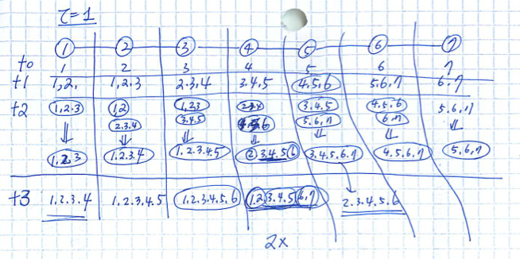

Idea
====

In pervasive computing networks, resources such as bandwidth and device
power are limited. When sharing individual contexts for computing group
context is needed, exchanging the contexts among nodes may prohibitively
expensive in terms of resource consumption.

The idea is that we can share the individual context among close
neighbors controlled by :math:`\tau`. A node sends individual contexts it
receives when the hop-count is less or equal than :math:`\tau`.

On the other hand, group contexts are shared among nodes. A group
context received from neighbor nodes can be analyzed and effectively
added more information to aggregate group information.

In Fig 1, seven nodes are connected in serial to share individual and
group contexts. We assume :math:`\tau`, and group contexts are calculated
and shared only when individual node acquires other's individual or
group contexts. We also assume individual contexts are exchanged only
once in this example. After the construction of group context, only the
group context is shared among nodes. The aggregate function is averaging
the values sensed within the network. The notation [1,2,3] represents a
set of individual context 1,2, and 3 whereas (1,2,3) represents the
group context constructed out of node 1,2, and 3.

At time 0, each node has its own context only. When individual contexts
are exchanged among them at time 1, each node calculates group context
based on the shared individual context. The circle represents the group
context where numbers in it shows the node numbers that contribute to
calculate group information.

Node 4 receives group context from node 3 and 5. Notice that the context
value 2 can be calculated from the combination of group context (2,3,4)
and individual contexts [3,4]. The same is true with the group context
from node 5; the context value 6 can be calculated. As a result, at time
2, node 4 attains the context information from node 2 to node 6 to form
a new group context.

At time 3, with [2,3,4,5,6] and (1,2,3,4,5) from node 3, the context
information from node 1 is calculated. The same is true with node 7 to
get average value.

For those nodes at the ends of the network topology, it takes more time
to calculate average value, but ultimately all nodes can share the
average value sooner or later.

   Fig 1
   
In real networks
================

In real networks, we need to consider other factors

1. Network topology is not in serial, it is in mesh.
2. The sensed data is stream-lined, not just one time sampling and
   sharing
3. The communication link can be broken to miss some of the
   individual/group context information.

Inference of missing information
--------------------------------

For the missing information, we can use the spatial (information from
nearby nodes) or temporal (information from previous sampling)
information to guess the value with confidence range. We are going to
use statistical and stochastic approaches to model the inference
process.

Updating information
--------------------

Streamlined context information indicates the individual/group contexts
shared at time n is different from time n+1. When we need to acquire the
trends of average value over a range of time, we need to devise an
algorithm to efficiently calculates the average under the dynamics in
network.

Program
=======

The snapshot program is a simulator to analyze the effects from sharing
group and individual contexts. We develop a software tool that enables
the calculation and inference of missing/unknown data with different
network configuration and state of environment.

Plan
----

We aim to develop two kinds of a tool.

1. Developing an inference engine

-  Given a set of individual context and group context, how can we infer
   the individual contexts in a group context.
-  How can we define a degree of confidence and calculate it.

2. Developing a simulation environment

-  Given a network configuration as a graph, how can we calculate the
   missing/uncertain data using the inference engine.
-  Based on the ground truth, how can we visualize the differences and
   similarities between ground truths and calculated results.

